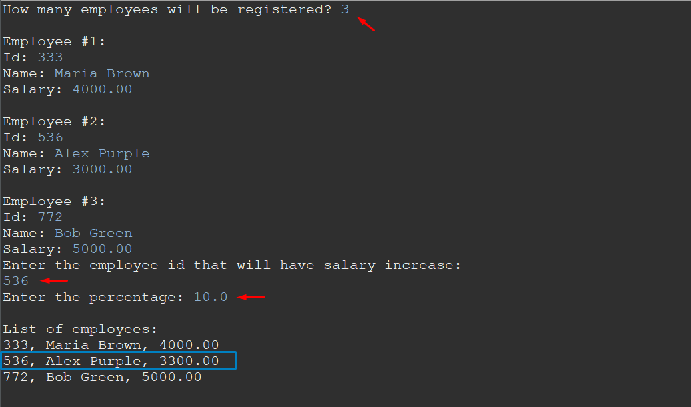

# Sistema de Gerenciamento de Funcionários

Este é um programa em Java para gerenciar os dados de funcionários. O programa permite a leitura de informações de funcionários, realização de aumento de salário com base em porcentagem e exibição dos funcionários atualizados.

## Funcionalidades

1. Ler o número inteiro N de funcionários.
2. Ler os dados (id, nome e salário) de N funcionários, garantindo que não haja repetição de id.
3. Efetuar o aumento de X por cento no salário de um determinado funcionário.
4. Mostrar a listagem atualizada dos funcionários após o aumento de salário.

## Uso

1. Execute o programa Java.
2. Insira o número inteiro N de funcionários.
3. Para cada funcionário:
   - Insira o id
   - Insira o nome.
   - Insira o salário.
4. Caso deseje aumentar o salário de um funcionário:
   - Insira o id do funcionário.
   - Insira o valor X em porcentagem a ser aumentado.
5. O programa exibirá a listagem atualizada dos funcionários com os salários ajustados.

## Considerações

- O programa utiliza encapsulamento para garantir que os salários só possam ser aumentados com base em uma operação de aumento por porcentagem.
- Caso o id informado para aumento não exista, uma mensagem de erro será exibida e a operação será abortada.

## Exemplos

Exemplo de entrada/saída:

